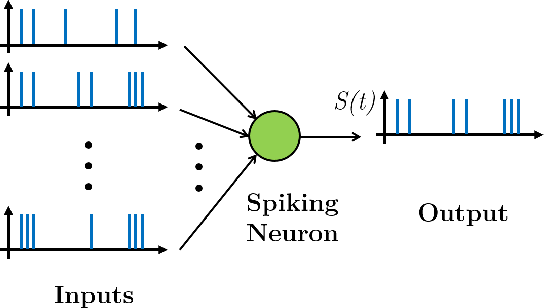
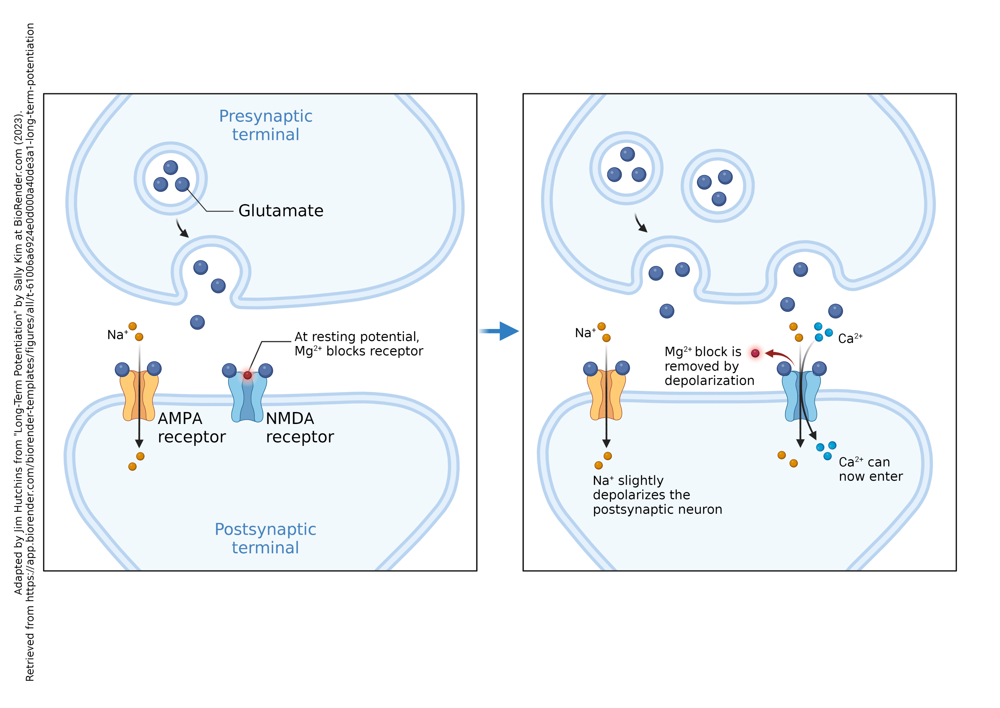
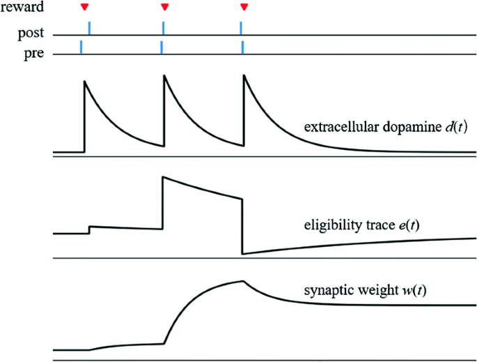

# Spiking Neural Network (SNN) Training with SpykeTorch

## Introduction

This repository provides an implementation of Spiking Neural Networks (SNNs) using the SpykeTorch library. SNNs are a type of artificial neural network that more closely mimic the neural mechanisms of the brain, offering potential advantages in computational efficiency and power consumption. This repository includes various SNN architectures and training methods, including Spike-Timing Dependent Plasticity (STDP) and Reward-Modulated STDP (R-STDP).



## What is an SNN?

A Spiking Neural Network (SNN) is an artificial neural network that models neurons more realistically by using spikes to process and transmit information. Unlike traditional artificial neural networks that use continuous values for neuron activations, SNNs operate with discrete events (spikes) that occur at specific points in time.

## What is STDP?

Spike-Timing Dependent Plasticity (STDP) is a biological learning rule observed in the brain. It adjusts the synaptic strength between neurons based on the relative timing of their spikes. If a presynaptic neuron's spike precedes a postsynaptic neuron's spike, the connection is strengthened (Long-Term Potentiation, LTP). Conversely, if the postsynaptic spike precedes the presynaptic spike, the connection is weakened (Long-Term Depression, LTD).



## What is R-STDP?

Reward-Modulated STDP (R-STDP) extends the STDP learning rule by incorporating a reward signal. This reward signal modulates the synaptic changes induced by STDP, allowing the network to learn from both the timing of spikes and an external reward signal, which is useful for reinforcement learning tasks.



## SpykeTorch

This codebase utilizes the [SpykeTorch](https://github.com/miladmozafari/SpykeTorch) library, which provides tools for implementing and training SNNs with STDP and R-STDP learning rules.

## Repository Organization

- `s1c1.py`: Contains a class that extracts edges using Differences of Gaussians (DoG) and performs intensity-to-latency encoding.
- `utils.py`: Contains utility functions used throughout the project.
- `train.py`: The main script for training and evaluating the models.
- `network_trainer.py`: A general class that contains methods to train and evaluate SNNs. It serves as a parent class for the models.
- `models/`:
  - `mozafari2018.py`: Contains the SNN architecture explained in the paper by Mozafari et al., 2018.
  - `deep2024.py`: Implements a deep network with three STDP layers and one R-STDP decision-making layer.
  - `deepr2024.py`: Contains two networks with two STDP and two R-STDP layers. One network trains all R-STDP layers together, while the other trains them in a greedy manner.
  - `inception2024.py`: A deep network with an inception-like block that extracts features over different scales.
  - `majority2024.py`: Similar to `inception2024.py` but uses a form of population coding with a majority rule instead of concatenating parallel layers.

## Getting Started

### Prerequisites

- Python 3.11.7
- PyTorch
- SpykeTorch
- Other dependencies as listed in `requirements.txt`

### Installation

Clone the repository:

```bash
git clone https://github.com/aidinattar/snn.git
cd snn-training-spyketorch
```

Install the required dependencies:

```bash
pip install -r requirements.txt
```

## Training and Evaluation
To train and evaluate a model, use the `train.py` script. For example, to train the DeepSNN model on the MNIST dataset:

```bash
python train.py --model deep2024 --epochs 2 4 4 10 --tensorboard
```

### Models
#### Mozafari2018
This model implements the architecture described in the paper by Mozafari et al., 2018. It uses STDP for training.

#### Deep2024
A deep SNN with three STDP layers and one R-STDP decision-making layer.

#### Deepr2024
Contains two networks with two STDP and two R-STDP layers. One network trains all R-STDP layers together, while the other trains them in a greedy manner.

#### Inception2024
A deep network with an inception-like block that extracts features over different scales.

#### Majority2024
Similar to inception2024.py but uses a form of population coding with a majority rule instead of concatenating parallel layers.


## Acknowledgements
This repository is based on the work of Mozafari et al. and utilizes the SpykeTorch library for SNN training and evaluation.

## License
This project is licensed under the MIT License - see the [LICENSE](LICENSE) file for details.
